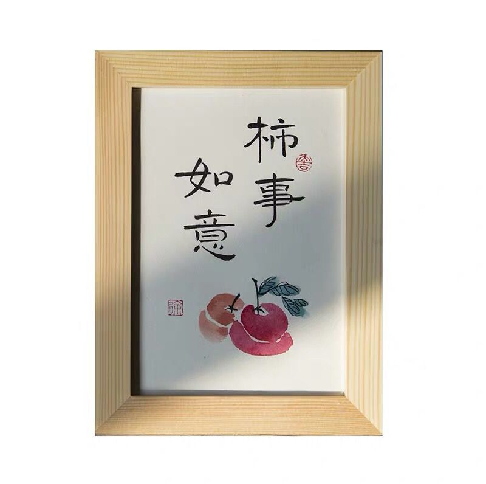
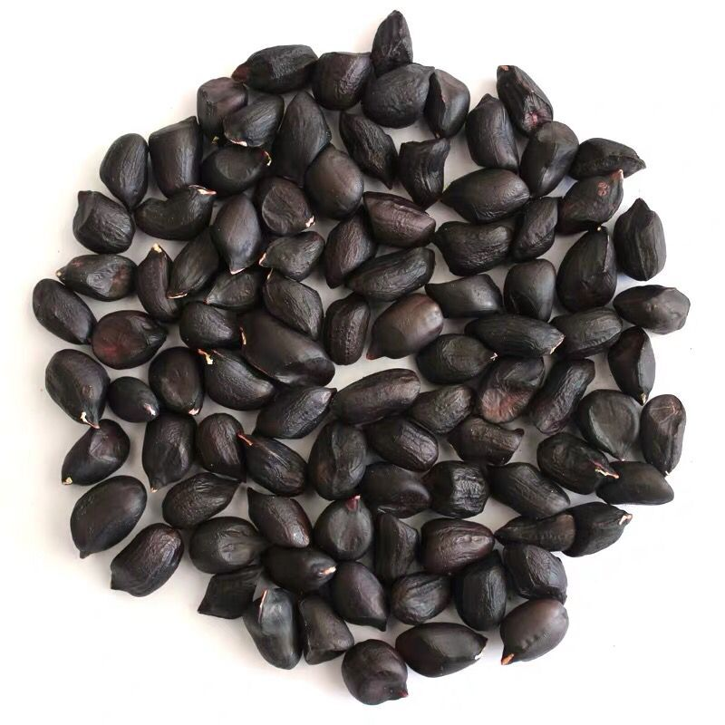
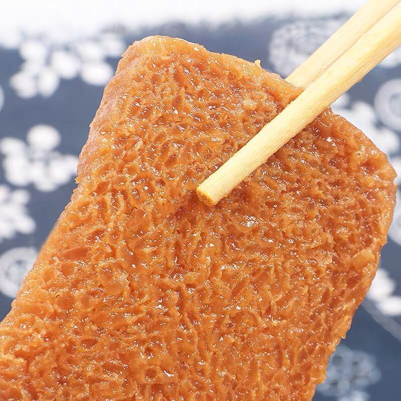
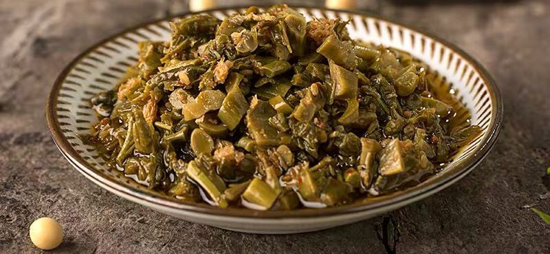

<body>
	

		<!-- 设置logo -->
		

			
		

		

			<ul>
				<li><a href="#">注册</a></li>
				<li><a href="#">登录</a></li>
			</ul>
		

	

		

			<ul>
				<li>
					
					

						<h1>儿童书画作品（可带相框）</h1>
						

							儿童书画作品（可带相框）
						

						
 
							<!-- 价格，购买logo -->
							
¥20-80元/幅

							<!-- 购物车按钮 -->
							

								
							

						

					

				</li>

				<li>
					
					

						<h2>大竹黑花生</h2>
						

							大竹黑花生
						

						
 
							<!-- 价格，购买logo -->
							
¥35元/斤

							<!-- 购物车按钮 -->
							

								
							

						

					

				</li>

				<li>
					
					

						<h3>黄粑 </h3>
						

							黄粑 
						

						
 
							<!-- 价格，购买logo -->
							
¥30元/斤

							<!-- 购物车按钮 -->
							

								
							

						

					

				</li>

				<li>
					
					

						<h4>醪糟</h4>
						

							醪糟
						

						
 
							<!-- 价格，购买logo -->
							
¥15元/斤

							<!-- 购物车按钮 -->
							

								
							

						

					

				</li>

				<li>
					
					

						<h5>香椿酱</h5>
						

							香椿酱
						

						
 
							<!-- 价格，购买logo -->
							
¥40元/斤

							<!-- 购物车按钮 -->
							

								
							

						

					

				</li>

				<li>
					
					

						<h6>观音豆干</h6>
						

							观音豆干
						

						
 
							<!-- 价格，购买logo -->
							
¥25元/斤

							<!-- 购物车按钮 -->
							

								
							

						

					

				</li>
			</ul>
			
		

</body>
